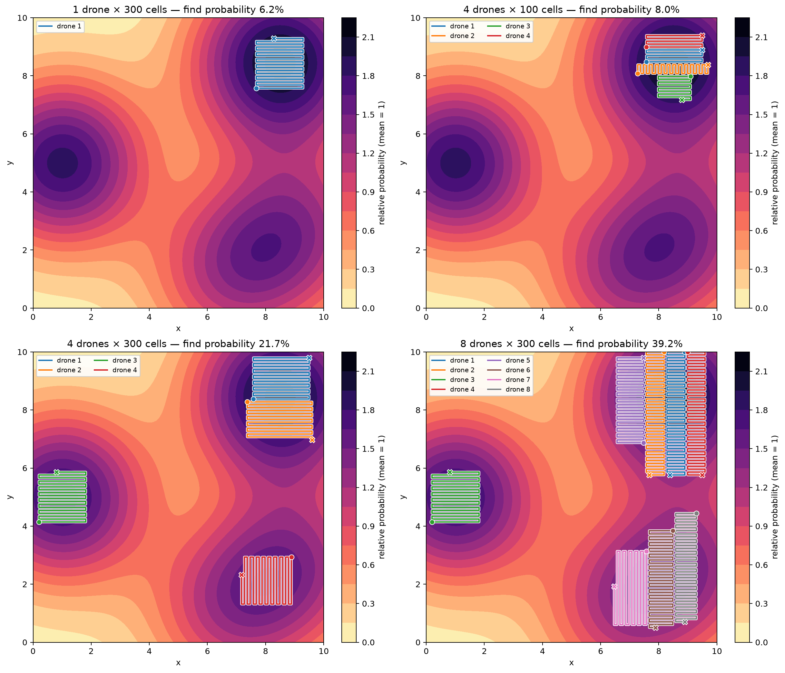
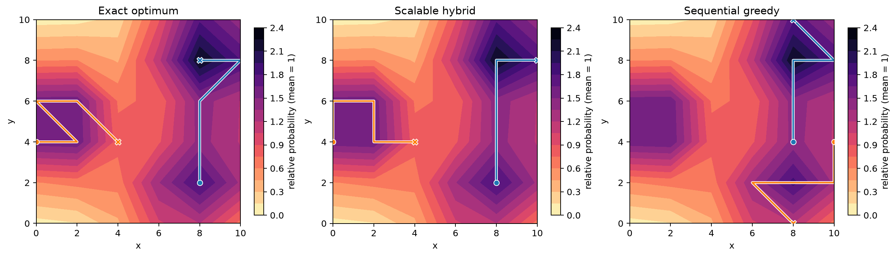

# Coordinated probability-weighted drone search

This project resolves the route-planning problem posed in Andrew Wheeler's 2020 post, [“A failed attempt at optimal search paths”](https://andrewpwheeler.com/2020/12/20/a-failed-attempt-at-optimal-search-paths/).

The problem is a grid version of the **team orienteering problem**: choose `k` mutually disjoint, fixed-budget paths that maximize the probability mass searched. Every consecutive pair of cells is 8-neighbor adjacent, every path is simple, starts and ends are free, and turns have zero cost.

The implementation combines:

- a full time-indexed CP-SAT model that certifies small cases;
- scalable route generation (compact sweep templates plus endpoint beam search); and
- a CP-SAT set-packing master problem that selects the best nonoverlapping combination from the route library; and
- iterative translation enrichment that closes gaps created when coordinated routes need to fit tightly together.

The main deliverables are `optimal_search.ipynb` and its executed export, `optimal_search.html`. The reusable implementation is in `search_planner.py`.

## Results

- [View the executed notebook](optimal_search.ipynb)
- [Download the standalone HTML report](optimal_search.html)
- [View the scenario results](artifacts/scenario_results.csv)

### Full-scale optimized flight paths



### Exact small-instance validation



## Reproduce

```powershell
.\run.ps1
```

The script uses `uv` in copy mode for compatibility with Dropbox on Windows and isolates Jupyter from machine-wide configuration. The notebook fixes the random seed and records route validity, objective values, upper bounds, and solver status.
